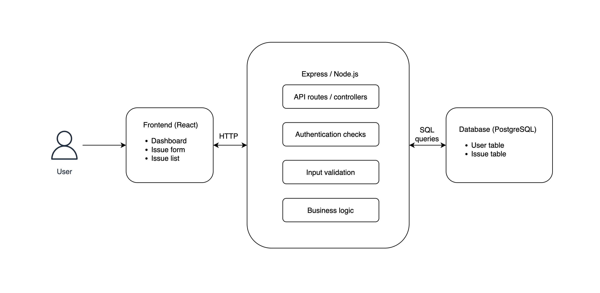

# Architecture

## Overview

The Issue Reporting System is a three-layer web application:

A React single-page application (SPA) renders the UI in the browser
and communicates with an Express REST API over HTTP. The API performs
authentication, input validation, and business logic, then issues
parameterised SQL queries against a PostgreSQL database.

## Layers

### Frontend (React 18 + TypeScript + Vite)

Responsibilities: rendering the UI, capturing user input, calling
the API, displaying results and errors. Stateless beyond local
component state and a JWT held in memory after login.

### Backend (Express + TypeScript on Node.js)

Responsibilities: routing, request validation via Zod schemas,
authentication via JWT verification middleware, query orchestration,
and error handling. Deliberately thin — no ORM, no service layer
abstraction beyond a `db/queries.ts` module — to keep the prototype
auditable within TM470 scope.

### Database (PostgreSQL 16)

Responsibilities: durable storage of users and issues, relational
integrity via foreign keys, value constraints via CHECK clauses on
status and priority. Schema versioning is handled through
incrementally numbered files in `database/migrations/`.

## Key decisions

- **Monorepo over split repos** — single source of truth, easier to
  reason about cross-cutting changes during a single-developer project.
- **No ORM** — direct parameterised queries via the `pg` driver.
  This keeps the SQL visible in the codebase, which is appropriate
  for a prototype intended to demonstrate database modelling.
- **Stateless JWT auth** — no session store needed, which simplifies
  deployment and reduces moving parts.

## Out of scope

Workflow automation, third-party integrations, email notifications,
file attachments, role-based permissions beyond authenticated/not.
